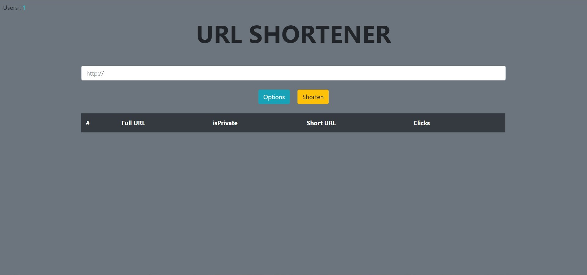

# Shortify

A url shortening dynamic website
[Deployed version]()

---



---

## Installation

### Requirements

You will need [Nodejs](https://nodejs.org/en/) and [MongoDB](https://www.mongodb.com/)

### Setup

1. Clone this repository.

   ```sh
   git clone https://github.com/karmanya007/url-shortener.git
   ```

2. Make config.env file and put the following variables:
   ```sh
   NODE_ENV=development
   PORT=3000
   DATABASE=<Your mongodb connection string>
   DATABASE_LOCAL=mongodb://localhost:27017/shortify
   DATABASE_PASSWORD=<Your database connection password>
   ```
3. Open this directory in the terminal and run:

   ```sh
   npm install
   npm run dev
   ```

4. Visit http://localhost:3000/

## Usage

Start creating short urls either for you only or for the world!

:smile:ENJOY:smile:
